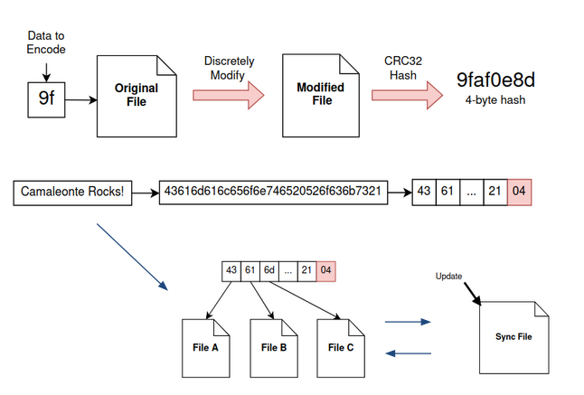
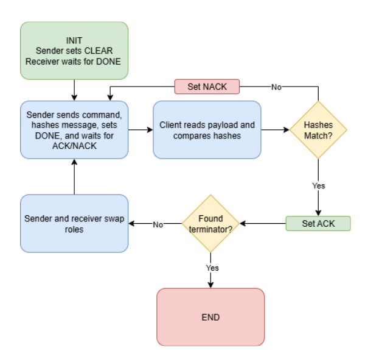

# Documentation for $C^3$

This document covers the design choices made for the underlying protocls/encoding schemes our covert channel depends on.

## Keywords

1. Clients - The endpoints for communication. Normally provided by executing a payload. It is where commands on the C2 framework are executed

2. Servers/Handlers - A metasploit term for the process that handles a connection to a client. Think of this as the process that you use to interact with the clients through the filesystem. Also can be referred to as a server.

3. Filesystem - The entirety of the filesystem and all the files used to send information. For cloud computing the filesystem could mean the google cloud folder with google doc files, whereas on a linux machine it could mean a NFS with image data stored on it.

4. Virtual filesystem - A division within the filesystem performed to allow multiple clients to communicate using the same filesystem. This provide a one-to-many communication framework through a shared filesystem. A filesystem is normally split up into different virtual filesystems to support multiplicity of communication.  

5. Packet - A packet of information is used to describe when a virtual file system is filled and sent to the reader. A very long message may be split up into packets which has to be transmitted in parts until finished. A packet is a section of this longer transmission. Sometimes a packet is referred to as batches in our codebase (not to be confused with Google Drive's batch requests)

## Assumptions

1. Server listener starts before the client payload is executed.

2. There are sufficient files in file share per client to facilitate maintainable communications
    - At minimum there should be 3 files, but more files decreases the probablity of deadlocks (server and client both stuck waiting)

3. No files deleted during transmission. Files may be edited as we have implemented noise dectection.

4. Only one client attempts to connect at a time. 

5. New clients only connect when all other connected clients are idle (not sending messages).

6. For the metadata protocol, we assume there are no pre-existing metadata properties on the files.

7. For the hash protocol, we assume the files are UTF-8 encoded (.txt, .md, .json, etc.)

## Writing and Reading Files

At the core of all the current protocols and mediums of communication follow the same writing and reading procedure. 

    

A filespace shares two processes. A server and a client. Only one of these processes can write to their specific portion of the file system at one point in time. This portion is denoted by the blue section in the diagram shown above. This uses a sync file (red portion) to act as a semaphore in which signals can be sent. The other process will wait for a change to that file which signals that the other process has completed writing. When the user is inputting a command, it is the handlers "turn" to write into the filespace and hence the payload is waiting for the user to press enter.  

For multiple processes, we have the file system split up into different areas. We call these virtual file spaces (vfs), as they are a smaller subsections of the entire set of files which are used for a channel of communication. New VFS can be added whilst the original system is using the same set of files and the process will automatically split the files up. This is done through a distributed consensus process because there is no over-arching process/program which controls the files each process gets. Every handler and client understands what to do when a new client joins. This is signalled by the configuration file being edited to represent the new number of clients. This is stored via the configuration files hash. Hashing the configuration file and looking at the first 4 bits gives you the number of clients connected. This configuration files hash syncs the knowledge of how many clients are present between all processes and is shown in green in the diagram above. Everytime a process writes or reads the configuration file is checked for new handlers requesting clients.

There may not be enough files to write an entire message or transmit a file. In this case, the writer will write until all the files are used and then signal to the recepient to read the current "packet". Once the data is read and the reader signals that it is done reading. Then the writer sends the next packet. This process continues until the entire message sent.

To add error correction, we send a checksum hash with every packet. The receiver will parse the packet and verify that the calculated hash matches the checksum. If yes, then it asks writer to send the next packet. Else, it asks writer to resend the current packet. More info on error correction can be in a later section.

## Transmission Mediums

The transmission medium is the filesystem used to send information inbetween clients and servers. This describes the techniques that are applied to a filesystem and its virtual file systems.

### Google Drive

Current support for google drive requires the user to create a google console account and create a new desktop application with a `credentials.json` file. This requires pre-packaging with the metasploit client code to enable communication between the handler and client, which is currently not implemented.

### Linux File System

Current support for the linux file based systems (NFS, local filesystem, etc.) requires the user to specify a file path and ensure it is consistent across both the client and handler in order to facilitate communication. The files within the filepath are then used to facilitate the communication. 

## Transmission Protocols

The transmission protocol of a covert channel is the method used to send the data inbetween the payload and client using whatever transmission medium specified. On a file system the protocol is how we hide information into the files and communicate. The reading and writing process is transmission and protocol agnostic meaning the protocol affects the reading and writing to each individual file and what that action entails.

### Metadata Encoding Protocol

The metadata protocol functions by editing a files metadata properties to store and transmit file information. This is significantly faster than the hashing based protocol due to its ability to store more information without having to mine for 4 bytes worth of information to be sent.

For the Linux file system, we use `xattributes` to store information. This provides 2.56 KB per file.

For the GoogleDrive file system, we use `appProperties`. This allows 3.76 KB per file.

### Hashing Encoding Protocol

The hashing protocol focuses on storing the information within the value we get when we hash a file. Normally a hash is used to test integrity but the messages we want to send will be encoded within the actual hash of the file itself. The reading and writing is done by affecting the file until the first 2 hex bytes of the hash match the two hex bytes of the message we want to send.

When the hashed file does not equal the message in its first 2 byte values, we need to mine for it by constantly changing the file and hashing it to see if it matches. The mining process includes making an un-noticable change to the file and hashing it and observing the first four bits. If it doesnt match we edit the file again and rehash. This process repeats until we get a hash that matches the first 4 bits of that portion of the message. This currently adds spaces to a text file on both google drive and Linux file systems. We then recalculate the hash and keep mining until we get a value that equates to the required data to transfer. When the reader reads this message it just hashes all the files and takes the first 4 bits from each file to construct the message.

    

*Note: while this diagram is for the hash protocol, the underlying steps to send the message are the same as the metadata protocol. Just the encoding is different.*

## Payload Compilation

To compile the payloads, you can run the script `compile.sh` located within the `client.py`. For further information on this process please locate the instructions found in the `Usage.md` document.

## Error Correction & Signalling
We implemented the following signals that the sender and receiver send to eachother to indicate the next step:

- CLEAR
- DONE
  - Used the by the sender to indicate it is done writing the current packet
- ACK
  - Used by the receiver to indicate it is ready to move on to the next packet
- NACK
  - Used by receiver to indicate to the sender to resend the current packet. 

Error correction was added to the sync file messaging system to send multiple types of signals, similar to how TCP works. The algorithm is capable of sending both `ACK` and `NACK` signals which can acknowledge when a packet was recieved correctly. This is sent alongside a hash to ensure we can ensure validity of a message.

The `CLEAR` signal is used when the channel for communication is clear and another packet can be sent of the original message. This is performed when there arent enough files to send the full encapsulated message. The `DONE` signal is then used to signal that the full message is completed in transmission or that the full message has been read. The current method used is shown in the image below. This is agnostic of the transmission medium and is performed inbetween a single payload and session. 

## Contact Us

For future questions, feel free to contact the developers:

1. Salaj Rijal [Github](https://github.com/srijal30)
2. Jonathan Mazurkiewicz [Github](https://github.com/jonmaz4410)
3. Arif Meighan [Github](https://github.com/Peptidase)