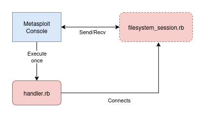

## Metasploit Integration

To get the covert channel working with metasploit a ruby translation was performed from the python code that was created in the prototyping stage. The image below shows the progression and timeline of development.

<image src="images/Timeline.png">

The features for multi-user communication, error correction and the reverse shell componenet were all added in and designed during the python period of the project. When integrating into metapsloit, ChatGPT was used to help refactor the code into a workable auxilary module. This produced a prototype that worked once integrated into metasplout as an auxilary handler. 

Metasploit uses the `modules` folder which contains all the different types of exploits. We use the `auxiliary` folder to store our covert channel. This was done because we could easily incoprorate the module as an auxilary module and run scripts from this, rather than having to shoe-horn the idea into the payload class that requires alot more overhead from metasploits payload class. It was more of a blank canvas which could be used to generate a sole covert channel functionality. We could just create a new handler class which could be called from the metasploit command line. In this implementation initially, there was no integration with the metasploit session system which meant when the auxilary process ended the covert channels serverside connection would terminate. Auxilary modules are designed to run once when called and as everything was handled in a single file that incorporated the protocol and medium logic this didnt work. We would run a loop to take user input but then the console would not be useable because as soon as you exit the loop to do something else in the console, the session would not be reobtainable.

To create this session functionality and all the functionality a typical module has we incorporated the necessary metasploit classes to have that functionality we needed so a redteamer could use and leverage this tool.

The two files of note are:

* `handler.rb` - The initial entrypoint. This has a defined function `run` that is called when the redteamer types the command `run` command after  `use auxiliary/camaleonte/handler`. This handler is where the file system can be specified and the protocol and medium. This is where, once you make a new filesystem, you would add it as a command line argument to appear in metasploit. 
* `filesystem_session.rb` - This is the session object that remains running after the handler exits from execution. This incorporates the functionality that allows for session exiting and resuming. 

To include this session handling and other metasploit functionality like up arrows showing the previous commands we included the necessary classes `Session::Interactive`. The `auxiliary/camaleonte/filesystem_session.rb` file contains this and then defines the functions required to when a user interacts with the session. The `filesystem_session.rb` is the session that is created when the auxilary handler is created. The top of the `filesystem_session.rb` is shown below:

```ruby
module Msf
  module Sessions
    class FilesystemSession
      include Msf::Session::Basic
      include Msf::Session::Interactive

      attr_accessor :shell, :interacting, :type, :desc,
                    :arch, :name, :platform, :tunnel_peer, :tunnel_local,
                    :alive, :sname

      # create a wrapper for Shell module so we can instantiate a class
      class FilesystemShell
        include Rex::Ui::Text::Shell
      end
```

We include both Basic session handling and interactive. This interactive process is what lets us use the command `session -i <session number>` to resume the session and also lets us background it to maintain persistence to a shell. We also create a custom shell class that contains the functionality of a shell named `Filesystemshell` which is used in the constructor to specify the `shell` attribute.

When the handler executes and generates the session, the handler exits and the session maintains the connection to the filesystem. This is agnostic of all mediums and protocols and is generalisable to new channels as long as they are included within the arguments. 



The current implementation works with the cloned repo with the `bundle exec ./msfconsole` command. We also had to add extra lines to the `Gemfile` configuration in the main repo to allow for google drive functionality to be added. This differs when you install the metasploit console via conventional methods like `sudo apt install metasploit` which we haven't got our module working with yet. The `Gemfile` and associated files for the program are scattered in `usr` and other locations we never got round to indexing and it was different for seperate machines increasing the complexity. In order to get a working prototype please follow the `README.md` for installation instructions.

