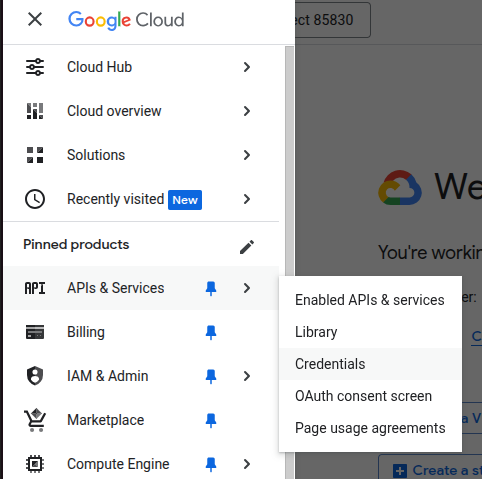
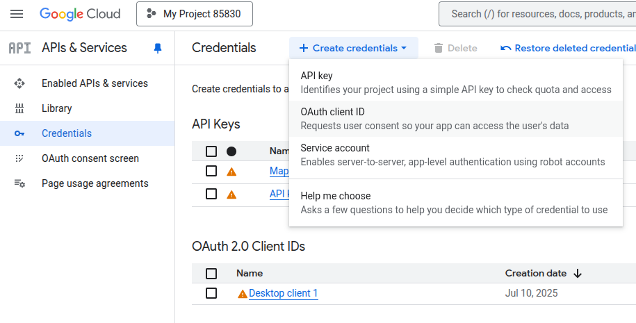
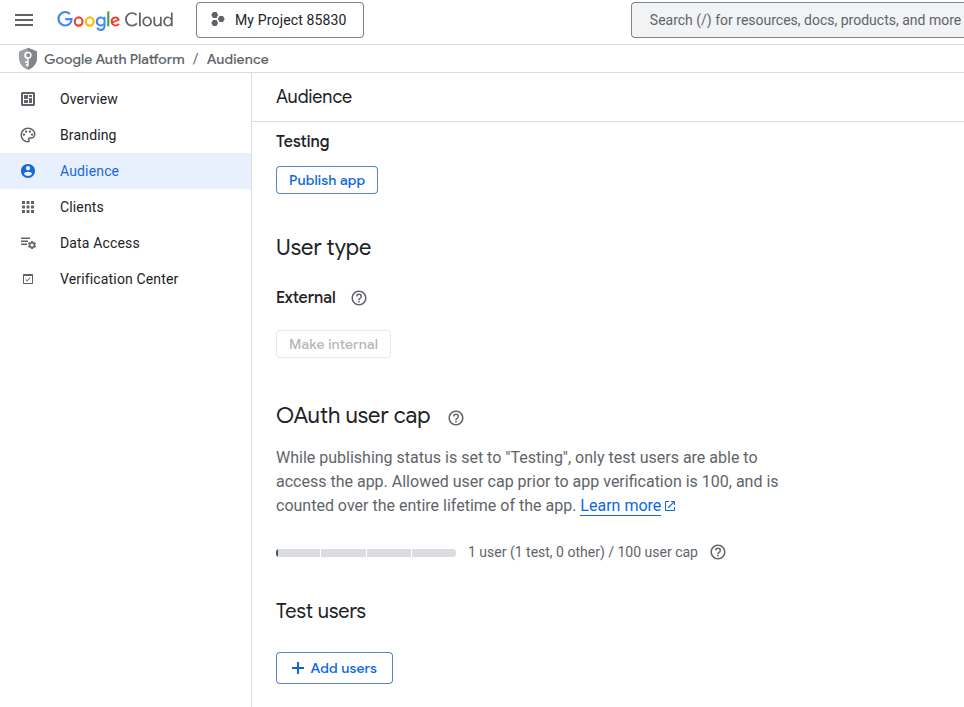
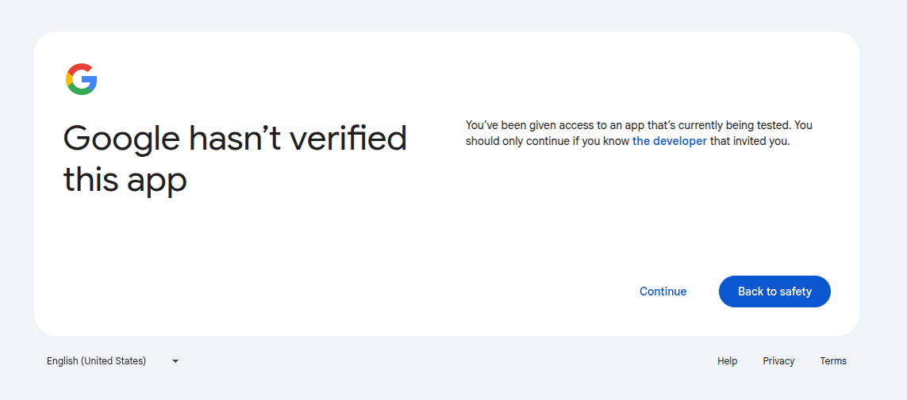
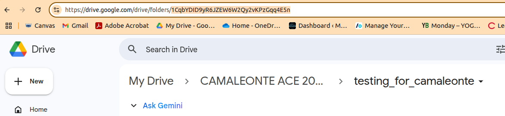
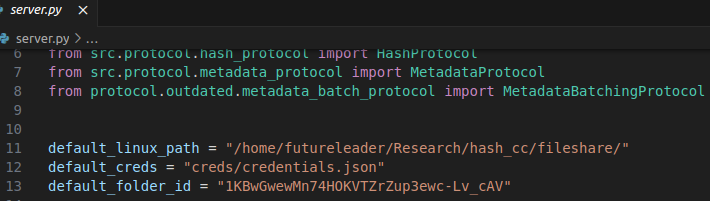

# Python Usage

This document discusses how the Python codebase works. It shows proof of concept for how to run the system effectively.

The python codebase is located in the `python-cc` folder.


## Install Virtual Environment
First you must install the dependencies. Enter the python codebase folder and run the following commands:

Ensure that the [venv](https://realpython.com/python-virtual-environments-a-primer/) module is installed. Then create a new virtual environment and start it:
```bash
python3 -m venv .venv
source .venv/bin/activate
```

Next, install all the required dependencies:
```bash
python3 -m pip install -r requirements.txt
```

## Google Drive -- One Time Setup

If not using Google Drive, skip this step.

In order to use Google Drive, you must set up your own account within Google Cloud Console. Currently, we use our own. Visit this website:
`https://console.cloud.google.com`

Create your own account and project. 

Then, navigate to APIs and services and select credentials



Then, go to create credentials at the top to create an OAuth client ID.



In application type, select Desktop app and give it a name.

### Generate credentials

Once you create the OAuth client, download the JSON and place into the `/creds` folder within the repository. Rename file to `credentials.json`. From the menu on the left, navigate to OAuth consent screen (or find any other way to navigate to the OAuth menus, there are many). Select Audience from the left-hand menu. Add the email addresses of whoever will be working with this project. NOTE: It may take a few minutes for access to be allowed.



You can test to see if access has been granted by running the server with `python3 server.py`. If successful, it will open a browser. Continue past the warning screen...



This will generate a `token.json` within the `creds` folder. If you ever lose this token, repeat the process to regenerate the token.

To clarify, `credentials.json` links to the Desktop application, and `token.json` links to a specific Google account. Only users that the app creator from Google Cloud Console has approved may access the application and generate a token. The Google Drive used for this method will be associated with the token. 


## Default Folder Selection

Select the folder that will be used for the covert channel.

### If using Google Drive...
- Navigate to the desired folder within Google Drive.
- Ensure this Drive belongs to the same user as the generated token earlier.
- Ensure that there are at least 3 files in that directory.
- Copy the unique identifier from the URL line as seen within the below image



When running the server and client, you may paste this ID into the path each time. Or, you may navigate to `client.py` and `server.py` and paste to `default_folder_id`, 

### If using Linux Filesystem / NFS Share...

- Copy and paste the absolute path of the desired folder / mounted drive to `default_linux_path` within `client.py` and `server.py`.

EXAMPLE



NOTE: If you do not plan on using the folder repetitively, you may enter the paths for Google Drive folders or absolute paths for Linux/NFS when running client and server. 

## Execution

1. Open two terminals.
2. In the first terminal, run `python3 server.py`. Select your encoding scheme, medium, and file path (DEFAULT: Hash encoding, Linux filesystem, "/home/futureleader/hash-cc/fileshare/"). 
3. In the second terminal, run `python3 client.py`. Match the selections from the server.
4. Run commands!
5. The programs let you change the default path at runtime if necessary.


### Helper Scripts
Run helper scripts with the following syntax `python3 -m helpers.<scriptname>`

1. `clear.py` -- Used to clear all of the metadata from Google Drive. Update the folder ID and path before using.
2. `disrupter.py` -- Used to alter metadata in real-time with Google Drive. Run alongside of client and server to test error correction capabilities.
3. `printmetadata.py` -- Prints all metadata from files to check for errors, edge cases, or mistakes in clearing or writing to metadata with the Google Drive.
4. `setup.py` -- Creates files within the `fileshare` directory for testing as if it were a mounted drive.


## Compiling Portable Executable

In order to make the Python file more portable and runnable on a variety of machines, you will need to use [`nukita`](https://nuitka.net/user-documentation/). The authors note that the binary generated will not have the functionality to change its filesystem location and is hardcoded into the binaries information.

To begin, you must first create a virtual enviroment with the modules required for the compiled binary. 

```bash
python3 -m venv .venv

source .venv/bin/activate

python3 pip install -r requirements.txt

python3 -m pip install Nuitka
```
Following an installation of Nuitka, ensure you are successful by checking the version on your machine.

```bash
python3 -m nuitka --version
```

Then navigate to where the `client.py` file is. Edit the contents and ensure the filesystem type and parameters are set. This will be the same information that is used by the handler ruby file when working within metasploit. The file when it runs should work, but obviously requires python and the virtual enviroment to be installed if it uses extra modules.

To fix this we can now use Nukita to covert the python code into C primitives and then compile it. This can take some time when performing it to generate a standalone onefile solution. This makes a file that is significantly smaller than PyInstaller as the IDLE interpreter is not stored alongside the executable.

```bash
compile.sh client.py .venv
```

*NOTE: compile.sh is located in the python-cc folder.*


The script takes two arguments, the first being the python file and the second is the virtual enviroment directory to install modules from. If the virtual enviroment is not provided or the compilation doesnt occur with the virtual enviroment sourced then nukita can install modules from the internet which ends up resulting in many resource files being generated making the executable not be as portable.

```bash
#!/bin/bash

# Exit on error
set -e

# Check number of arguments
if [ "$#" -ne 2 ]; then
  echo "Usage: $0 <python_file.py> <venv_directory>"
  exit 1
fi

PYTHON_FILE="$1"
VENV_DIR="$2"

# Check if the Python file exists
if [ ! -f "$PYTHON_FILE" ]; then
  echo "Error: Python file '$PYTHON_FILE' does not exist."
  exit 2
fi

# Check if the virtual environment exists
if [ ! -d "$VENV_DIR/bin" ]; then
  echo "Error: Virtual environment directory '$VENV_DIR' is invalid."
  exit 3
fi

# Activate the virtual environment
source "$VENV_DIR/bin/activate"

# Compile the Python file
nuitka client.py --standalone --onefile

echo "Compilation complete: $PYTHON_FILE"

# Deactivate the virtual environment
deactivate

```
The command that compiles the file into one singular portable binary is the following:  

```bash 
nukita client.py --standalone --onefile
``` 

This must be run in the context of whatever the virtual enviroment is with the activate command sourced with

```bash
source .venv/bin/activate
```
Following a lengthy compilation process, the resulting binary will be made in the current folder and named `client.bin`. Feel free to rename and move the binary around as now it is fully portable!